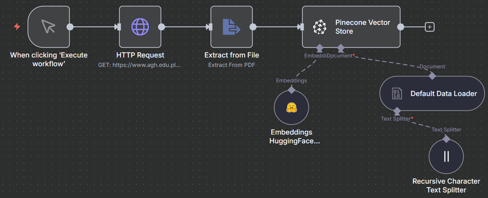
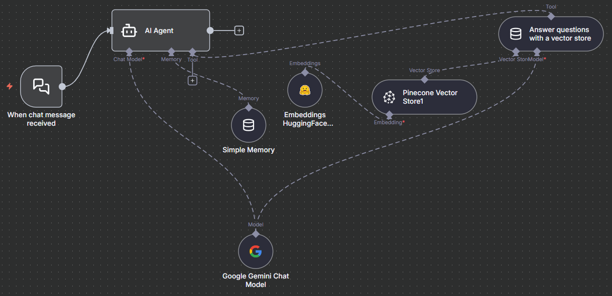

# RAG Knowledge Base and Chatbot

An automated dual-workflow system built in n8n designed to index complex PDF documents into a vector database and provide a context-aware AI assistant.
The system leverages a modular architecture for retrieval-augmented generation (RAG).

## Overview
This system transforms static PDFs into a "live" knowledge base, using university regulations as a primary case study. It allows users to query unstructured data through a natural language interface, ensuring responses are strictly grounded in official sources to prevent hallucinations.

## Architecture & Logic
The project is split into two specialized pipelines to ensure efficient data ingestion and intelligent retrieval:

* **Ingestion Pipeline (RAG Charger)**: An ETL process that fetches remote PDFs, extracts raw text content, and prepares it for the vectorization layer.
* **Vectorization Layer**: Employs a `RecursiveCharacterTextSplitter` with a 200-character chunk overlap to maintain semantic continuity across fragments. Embeddings are generated via HuggingFace Inference and stored in a Pinecone vector store.
* **Conversational Agent (RAG Chatbot)**: A LangChain-powered agent featuring a `Memory Buffer Window` to maintain dialogue context. It utilizes the Pinecone index as a primary tool to answer user queries in Polish, adhering to a strict system prompt.

## Tech Stack
* **Orchestration**: n8n (Dual-Workflow Architecture)
* **LLM**: Google Gemini API (PaLM)
* **Vector Store**: Pinecone
* **Embeddings**: HuggingFace Inference
* **AI Framework**: LangChain (Agent, Memory, and Vector Store Tooling)

## Implementation & Security
* **Context Grounding**: The agent is configured with a custom system message to answer questions ONLY based on the provided documents, ensuring high reliability in legal/educational contexts.
* **Credential Handling**: The provided JSON files contain credential IDs only. To run these workflows, you must link your own Gemini, Pinecone, and HuggingFace API keys within your n8n instance.
